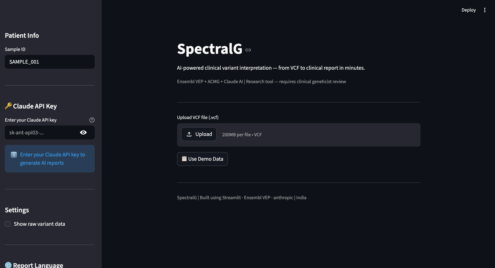
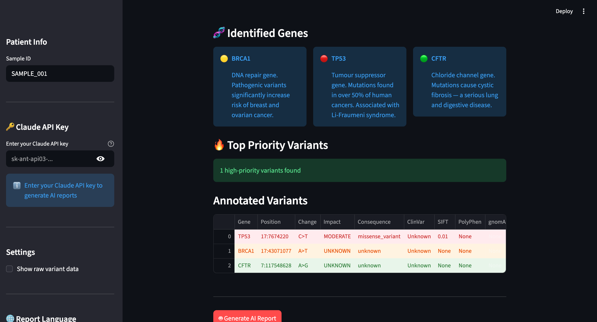

# 🧬 SpectralG — AI-Powered Clinical Variant Interpreter

> Automated clinical variant interpretation for Indian genomics labs.  
> VCF file → Ensembl VEP → ACMG classification → AI clinical report in minutes.

**Live Demo:** https://ai-variant-reporter-thvmkz7qltuhqpzfyzwzya.streamlit.app/

---

## Screenshots

### Summary Dashboard


### Identified Genes with Clinical Descriptions


### Colour-Coded Variant Priority Table


### Report- Word Docx.
![(screenshot_report.png)]
![(screenshot_report (2).png)]
---

## What SpectralG Does

SpectralG automates the clinical variant interpretation workflow that currently
takes bioinformaticians 4–8 hours per patient sample. It takes a standard VCF
file and produces a complete clinical genetics report in under 10 minutes.

### Pipeline
VCF File Upload
↓
VCF Parser — handles standard, SnpEff, VEP-annotated files
↓
Ensembl VEP Annotation — gene name, consequence, SIFT, PolyPhen
↓
Ensembl Overlap Fallback — identifies genes when VEP HGVS fails
↓
gnomAD Frequency Filter — removes common variants (AF > 1%)
↓
ACMG/AMP 2015 Classification — PVS1, PP3, PM2, PS, BA1 criteria
↓
Priority Ranking — HIGH / MEDIUM / LOW scoring system
↓
Claude AI Report Generation — structured clinical genetics report
↓
Download — TXT, JSON, Word (.docx)
---

## Features

- ✅ Parses standard VCF files including SnpEff and VEP-annotated formats
- ✅ Ensembl VEP REST API annotation — canonical transcript, SIFT, PolyPhen
- ✅ Ensembl Overlap API fallback — correctly identifies BRCA1, CFTR when VEP HGVS fails
- ✅ gnomAD allele frequency filtering — removes common variants
- ✅ ACMG/AMP 2015 classification — PVS1, PP3, PM2, PS1, BA1 evidence criteria
- ✅ Priority scoring — HIGH, MEDIUM, LOW with colour-coded table
- ✅ Summary dashboard — total variants, priority counts, ACMG pie chart
- ✅ Gene function cards — clinical descriptions for TP53, BRCA1, BRCA2, CFTR, HBB and more
- ✅ Claude AI clinical report — structured, professional, downloadable
- ✅ Multilingual reports — English, Telugu, Hindi, Tamil, Malayalam, Kannada
- ✅ Word document (.docx) download — formatted for clinical use
- ✅ User API key input — users bring their own Claude key
- ✅ Patient privacy warning — research tool disclaimer

---

## Tech Stack

| Component | Technology |
|-----------|-----------|
| Frontend | Streamlit |
| VCF Parsing | Custom Python parser |
| Variant Annotation | Ensembl VEP REST API |
| Gene Lookup | Ensembl Overlap REST API |
| Population Frequency | gnomAD via VEP |
| Clinical Classification | ACMG/AMP 2015 rules |
| AI Report | Anthropic Claude (claude-haiku-4-5) |
| Visualisation | Plotly |
| Word Export | python-docx |
| Deployment | Streamlit Cloud |

---

## Run Locally

```bash
git clone https://github.com/PrakashNK28/ai-variant-reporter.git
cd ai-variant-reporter
pip install -r requirements.txt
```

Create a `.env` file:
ANTHROPIC_API_KEY=your-claude-key-here
NCBI_API_KEY=your-ncbi-key-here
```bash
streamlit run app.py
```

---

## Demo Data

Click "Use Demo Data" in the app to test with 3 real genomic variants:
- **TP53** chr17:7674220 — missense variant, MODERATE impact, SIFT 0.01
- **BRCA1** chr17:43071077 — identified via Ensembl Overlap fallback
- **CFTR** chr7:117548628 — identified via Ensembl Overlap fallback

---

## Clinical Disclaimer

SpectralG is an **AI-assisted research tool** for educational and workflow
assistance purposes only. All reports require review by a qualified clinical
geneticist before any clinical use. Do not upload real patient VCF files to
the public demo. For clinical deployment, run locally on your institution's
secure network.

---

## Author

**Prakash NK** — MSc Human Genetics, Sri Ramachandra University  
Hyderabad, India | Building AI tools for precision medicine and clinical genomics

- LinkedIn: linkedin.com/in/prakash-nk-38447041
- GitHub: github.com/PrakashNK28
- Live tool: https://ai-variant-reporter-thvmkz7qltuhqpzfyzwzya.streamlit.app/
