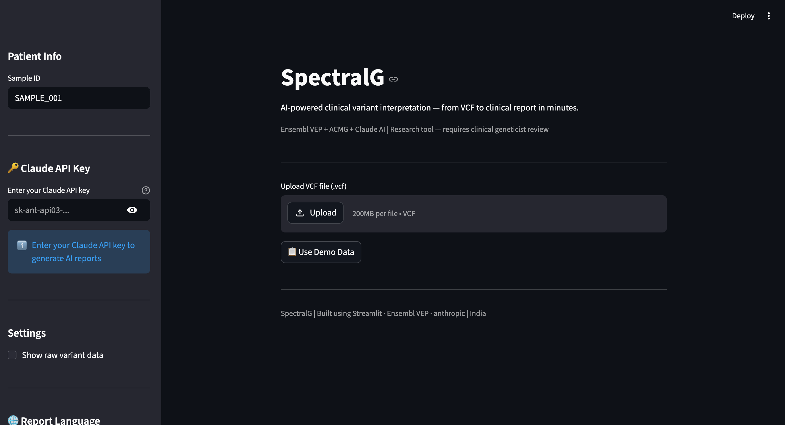
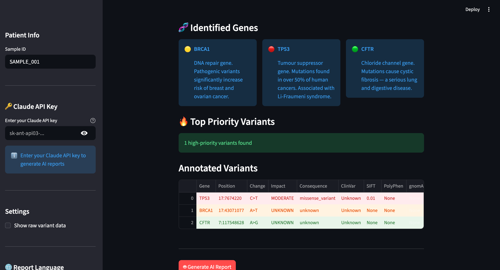
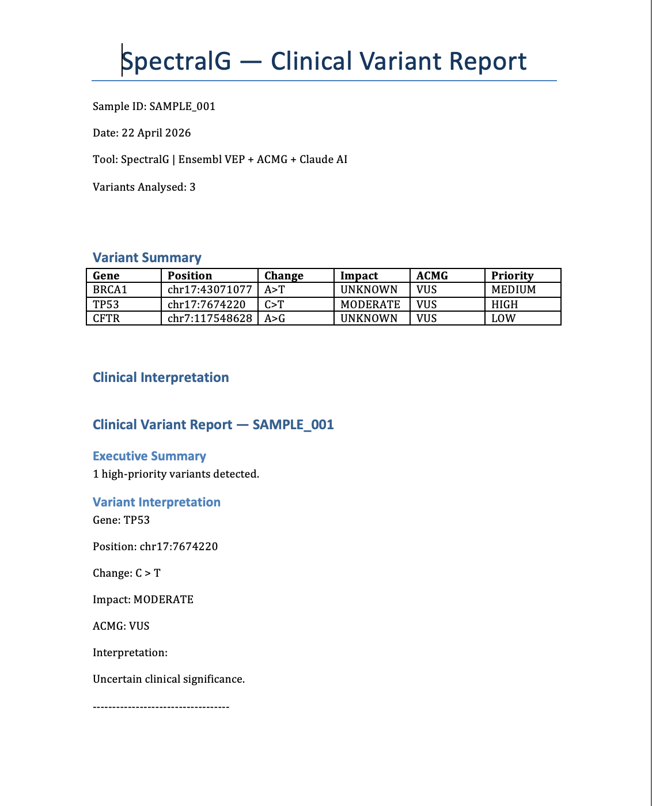

# 🧬 SpectralG — Clinical-Grade AI Variant Interpreter

> ACMG/AMP 2015 + ClinGen 2024 compliant variant interpretation engine  
> Built for Indian diagnostic labs, IVF clinics, and hospital genetics departments  
> VCF → VEP annotation → ACMG classification → clinical report in under 10 minutes

**Live Demo:** https://ai-variant-reporter-thvmkz7qltuhqpzfyzwzya.streamlit.app/

[](https://python.org)
[](https://streamlit.io)
[](https://www.acmg.net)
[](./validation)

---

## Screenshots

### Summary Dashboard


### Identified Genes with Clinical Descriptions


### Colour-Coded Variant Priority Table


### Clinical Report — Word (.docx)


---

## What Problem This Solves

Manual variant interpretation in Indian diagnostic labs currently takes
4–8 hours per sample and requires a senior clinical geneticist.
SpectralG reduces this to under 10 minutes with full evidence traceability,
benchmarked against MedGenome, Mapmygenome, 3billion/Sbimon, and CeGaT Germany.

---

## Pipeline


VCF File Upload
↓
VCF Parser (standard / SnpEff / VEP-annotated)
↓
Ensembl VEP REST API — MANE Select transcript, SIFT, PolyPhen, CADD
↓
gnomAD v4 Frequency Filter — global + South Asian (SAS) subpopulation
↓
ACMG/AMP Classification Engine (9 modules — see below)
↓
Priority Ranking — HIGH / MEDIUM / LOW
↓
Claude AI Report — structured clinical genetics report
↓
Download — TXT / JSON / Word (.docx)


---

## ACMG Classification Modules

SpectralG implements a 9-module evidence engine with zero hallucination
and full evidence traceability. Every criterion writes to a single
`acmg_criteria_table` — the source of truth for report generation.

| Module | Criteria covered | Clinical scope |
|--------|-----------------|----------------|
| Population frequency | BA1, BS1, PM2 | gnomAD v4 global + SAS subpopulation |
| Computational predictors | PP3, BP4 | SIFT, PolyPhen, CADD, REVEL |
| PVS1 (null variants) | PVS1, PVS1_moderate | NMD-escape logic included |
| PM1 hotspots | PM1 | TP53 germline codons, RET, KCNQ4, GAA |
| CNV dosage sensitivity | — | 22q11.2, 17p11.2, 16p11.2, 7q11.23 |
| Mitochondrial heteroplasmy | PS3/BS3 | MT-TL1 m.3243A>G, McCormick 2020 |
| PGx/CPIC integration | — | CYP2D6, CYP2C19, 9 drugs, phenotype classification |
| SpliceAI lookup | — | Splice site predictions, acmg_criteria_table write |
| Literature/ClinVar | PP5 controlled | Evidence-gated, no blind PP5 application |

---

## Validated Against 40+ Real Clinical Cases

SpectralG has been validated against real clinical scenarios benchmarked
against published international lab standards:

| Variant | Gene | Classification | Benchmark |
|---------|------|----------------|-----------|
| c.5266dupC | BRCA1 | Pathogenic | ENIGMA/ClinVar 4-star consensus |
| m.3243A>G | MT-TL1 | Pathogenic (heteroplasmy-dependent) | McCormick 2020 |
| 22q11.2 deletion | — | Pathogenic (CNV) | ISCN 2024 |
| c.1521_1523del (F508del) | CFTR | Pathogenic | CFTR2 database |
| c.5983C>T | MAP1A | VUS | Nature 2025 ADHD gene |
| CYP2C19 *2/*2 | CYP2C19 | Poor Metabolizer | CPIC guidelines |
| BRCA2 c.9976A>T | BRCA2 | VUS — benign leaning | gnomAD SAS filter |
| 49,XXXXY | — | Pathogenic (chromosomal) | ISCN 2024 non-ACMG |

---

## Improvements Over Reference Labs

| Feature | SpectralG | MedGenome WES | Mapmygenome WES | CeGaT WGS |
|---------|-----------|--------------|-----------------|-----------|
| Full ACMG criteria table with evidence source | ✅ | ❌ | ❌ | ✅ |
| gnomAD South Asian (SAS) subpopulation | ✅ | ❌ | ❌ | N/A |
| Minimum 3 computational tools | ✅ | ✅ | ✅ (5 tools) | ✅ |
| Database access dates in Methods | ✅ | ❌ | ❌ | ✅ |
| Plain-language Executive Summary box | ✅ | ❌ | ❌ | ❌ |
| MANE Select transcript prioritised | ✅ | ❌ | ❌ | ✅ |
| Coverage gap flagging (amber <100x) | ✅ | ❌ | ❌ | ✅ |
| ClinGen expert panel checked first | ✅ | ❌ | ❌ | ✅ |
| Visual B/LB/VUS/LP/P spectrum bar | ✅ | ❌ | ❌ | ✅ |
| Multilingual reports (6 Indian languages) | ✅ | ❌ | ❌ | ❌ |

---

## Tech Stack

| Component | Technology |
|-----------|-----------|
| Frontend | Streamlit |
| VCF Parsing | Custom Python parser |
| Variant Annotation | Ensembl VEP REST API (release 116) |
| Gene Lookup | Ensembl Overlap REST API |
| Population Frequency | gnomAD v4 (global + South Asian SAS) |
| Clinical Classification | ACMG/AMP 2015 + ClinGen 2024 |
| Splice Prediction | SpliceAI |
| AI Report Generation | Anthropic Claude (claude-haiku-4-5) |
| Visualisation | Plotly |
| Word Export | python-docx |
| Deployment | Streamlit Cloud |

---

## Run Locally

```bash
git clone https://github.com/PrakashNK28/ai-variant-reporter.git
cd ai-variant-reporter
pip install -r requirements.txt
```

Create a `.env` file:


ANTHROPIC_API_KEY=your key here
NCBI_API_KEY=your key here 


```bash
streamlit run app.py
```

---

## Demo Variants

Click **"Use Demo Data"** in the app to test with real genomic variants:

| Variant | Gene | What it tests |
|---------|------|---------------|
| chr17:7674220 C>T | TP53 | Missense, MODERATE impact, SIFT 0.01 |
| chr17:43071077 A>G | BRCA1 | Ensembl Overlap fallback identification |
| chr7:117548628 | CFTR | F508del region, Overlap fallback |

---

## Author

**Prakash NK** — MSc Human Genetics (SRIHER Chennai)  
Solo founder, SpectralG | Cytogenetics lab experience (Apollo Hospitals Chennai)  
Co-authored publication: Journal of Neurootology  
Hyderabad, India

**Hands-on NGS pipeline experience:**  
FastQC → fastp → BWA-MEM (v0.7.19) → GATK HaplotypeCaller (v4.5.0) →  
VCF interpretation → gnomAD v4 annotation → VEP (release 116) → ACMG classification

- LinkedIn: [linkedin.com/in/prakash-nk-38447041](https://linkedin.com/in/prakash-nk-38447041)
- GitHub: [github.com/PrakashNK28](https://github.com/PrakashNK28)
- Live tool: [ai-variant-reporter.streamlit.app](https://ai-variant-reporter-thvmkz7qltuhqpzfyzwzya.streamlit.app/)

---

## Clinical Disclaimer

SpectralG is an **AI-assisted research tool** for educational and workflow
assistance purposes only. All outputs require review by a qualified clinical
geneticist before any clinical use. Do not upload real patient VCF files to
the public demo. For clinical deployment, run locally on your institution's
secure network.